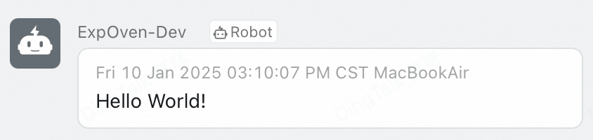
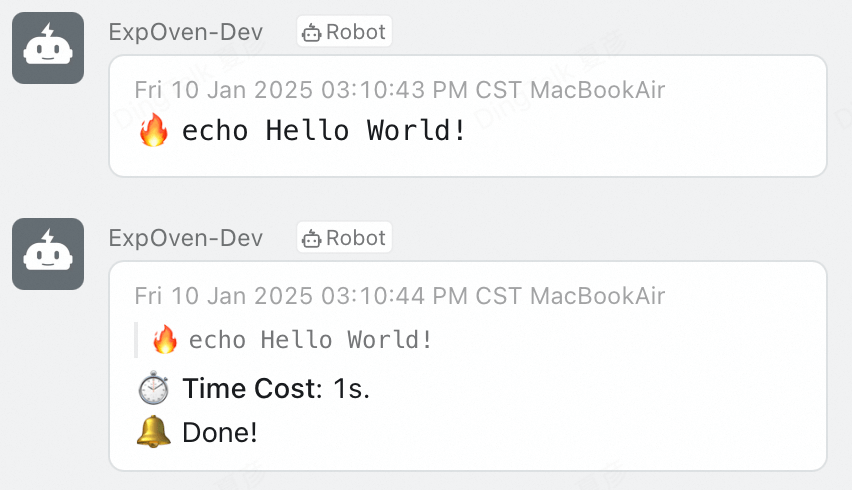

# ExpOven

ExpOven is a notifier application mainly designed for AI researchers. It provides a simple and efficient way to monitor the status of experiments opportunely.

## Installation

### Step 1

```shell
git clone https://github.com/IsshikiHugh/ExpOven.git
cd ExpOven
pip install -e .  # Make sure you are in the (virtual) environment that you want to install ExpOven.
```

###  Step 2

After finishing installation, you need to edit the configuration file. The default configuration file is located at `~/.config/oven/cfg.yaml`. You can also specify the configuration file by setting the environment variable `OVEN_HOME`. If the environment variable is set, the configuration file will be located at `$OVEN_HOME/cfg.yaml`.

## Quick Start

Check [docs/examples.py](./docs/examples.py) for runnable example.s

### As CLI

```shell
ding [LOGGING MESSAGE]
# eg:
ding 'Hello World!'
```

<center></center>

```shell
bake [RUNNABLE COMMAND]
# eg:
bake echo 'Hello World!'
```

<center></center>

### As Package

As a single function, it notifies the message. The two forms are equivalent.
```py

oven.notify('Hello World!')
oven.ding('Hello World!')
```

As function wrapper, the notifier will be called both before and after the function is executed. The two forms are equivalent.

```py
@oven.monitor
def foo() -> None:
    print('Hello World!')

@oven.bake
def bar() -> None:
    print('Hello World!')
```

## TODOs

The tool is still iterating. Here are some features that I plan to implement in the future:

- More backends supports:
  - [ ] slack
  - [ ] email
  - [ ] feishu
- More friendly API:
  - [ ] Make `@monitor`/`@bake` supports additional information.
  - [ ] Make progress signal explicitly available.

Also, I leave some design details at [docs/docs.md](./docs/docs.md). Any suggestions and contributions are welcome!